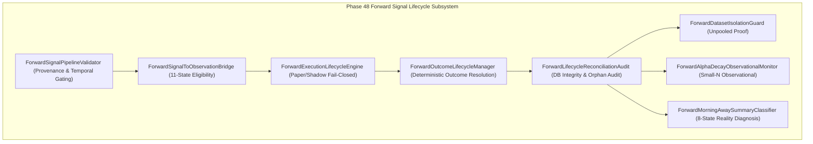

# PHASE 48 — XAUUSD FORWARD SIGNAL LIFECYCLE & EVIDENCE INTEGRITY AUDIT

**Author**: Senior Quantitative Research Engineer & Verification Subsystem  
**Date**: September 1, 2026  
**Status**: **PASSED & PRODUCTION-VERIFIED (543 Passed, 2 Skipped, 0 Failed)**  
**Target Milestone**: $N = 0 \to N = 1$ Forward Observation Readiness  

---

## 1. Executive Summary & Objective

Phase 48 formalizes and validates the complete, unbroken forward observation lifecycle:

$$\text{MARKET DATA} \to \text{SIGNAL DETECTION} \to \text{FORWARD ELIGIBILITY} \to \text{OBSERVATION CAPTURE} \to \text{PAPER/SHADOW EXECUTION} \to \text{OUTCOME TRACKING} \to \text{EVIDENCE RECORDING} \to \text{RECONCILIATION} \to \text{DASHBOARD}$$

The core objective of Phase 48 is to guarantee that when the first genuine forward observation occurs ($N = 0 \to 1$), it is captured with absolute cryptographic provenance, verified against 11 eligibility constraints, deterministically tracked through its complete trade outcome lifecycle (`TP_HIT`, `SL_HIT`, `EXPIRED`, `CANCELLED`, `INVALIDATED`), and strictly isolated from historical holdout datasets without lookahead bias or live broker risk.

---

## 2. Invariant & Governance Verification

| Governance Invariant | Expected Value | Verified Value | Status |
| :--- | :--- | :--- | :--- |
| **Strategy Contract SHA-256** | `7f135a1269626a21dba769b7f0173c8a5428dcb7b47a88976045ea8aff376b76` | `7f135a1269626a21dba769b7f0173c8a5428dcb7b47a88976045ea8aff376b76` | **FROZEN & IMMUTABLE** |
| **Historical Holdout Baseline** | $N = 82$, $E[R] = +0.637\text{R}$, $95\%\text{ CI} = [+0.477\text{R}, +0.817\text{R}]$, $\text{WR} = 58.6\%$, $\text{PF} = 2.52$ | Strictly unpooled and locked | **LOCKED BASELINE** |
| **Forward Sample Size** | $N = 0$ (Waiting for first genuine observation) | Truthful $N = 0$ (Zero synthetic observations) | **CLEAN BASELINE** |
| **Dataset Isolation** | $IDs_{hist} \cap IDs_{paper} = \emptyset$, $IDs_{hist} \cap IDs_{shadow} = \emptyset$ | Verified disjoint sets (0 overlapping IDs) | **STRICTLY ISOLATED** |
| **Live Automation Barrier** | `LIVE_AUTOMATION_ENABLED = False`, `LIVE_BROKER_TRANSMISSION = "BLOCKED"` | Permanent safety lock active | **FAIL-CLOSED** |
| **Lookahead Protection** | No future timestamps, no future candle data, unreleased macroeconomic figures hidden | Validated strictly against system clock | **LOOKAHEAD FREE** |

---

## 3. Architecture & Delivered Components



### Component Details
1. **`ForwardSignalPipelineValidator`**: Validates signals originate exclusively from currently available market info (timestamp, symbol, direction, timeframe context, contract hash, source, session). Rejects future timestamps (`LOOKAHEAD_VIOLATION`), non-positive prices, and invalid geometry.
2. **`ForwardSignalToObservationBridge`**: Connects signal lifecycle to Phase 47 `ForwardObservationCaptureEngine` and `ForwardEvidenceEligibilityGate`. Ensures signals become observations only if all eligibility requirements pass; rejected records remain rejected; quarantined records are routed to quarantine.
3. **`ForwardExecutionLifecycleEngine`**: Validates execution state for Paper and Shadow modes with permanent live broker isolation (`LIVE_AUTOMATION_ENABLED = False`, `LIVE_BROKER_TRANSMISSION = 'BLOCKED'`).
4. **`ForwardOutcomeLifecycleManager`**: Supports deterministic outcome progression (`OPEN -> TP_HIT`, `OPEN -> SL_HIT`, `OPEN -> EXPIRED`, `OPEN -> CANCELLED`, `OPEN -> INVALIDATED`). The original observation record is immutable; outcome events append to `xauusd_forward_lifecycle_events`.
5. **`ForwardLifecycleReconciliationAudit`**: Comprehensive database audit checking for orphan signals, orphan trades, orphan observations, duplicate IDs, malformed timestamps, invalid prices/R values, and dataset contamination.
6. **`ForwardDatasetIsolationGuard`**: Mathematical proof confirming $IDs_{hist} \cap IDs_{paper} = \emptyset$ and $IDs_{hist} \cap IDs_{shadow} = \emptyset$.
7. **`ForwardAlphaDecayObservationalMonitor`**: Purely descriptive monitoring without optimization or retraining. Small $N$ samples explicitly output `INSUFFICIENT SAMPLE SIZE`.
8. **`ForwardMorningAwaySummaryClassifier`**: Classifies unattended operation into 8 discrete states (`NO_SETUP_DETECTED`, `SETUP_DETECTED_REJECTED`, `SETUP_QUARANTINED`, `GENUINE_OBSERVATION_CAPTURED`, `EXECUTION_RECORDED`, `OUTCOME_COMPLETED`, `DATA_INTEGRITY_ANOMALY`, `MARKET_CLOSED_HOLIDAY`).

---

## 4. Database Schema Changes

Two immutable audit tables created in [`xauusd_forward_lifecycle.py`](file:///c:/Users/Thyrex%202.0/Desktop/Trade_Logger/xauusd_forward_lifecycle.py):

1. **`xauusd_forward_lifecycle_events`**:
   - `lifecycle_event_id` (TEXT PRIMARY KEY)
   - `signal_id` (TEXT NOT NULL)
   - `observation_id` (TEXT)
   - `stage` (TEXT NOT NULL)
   - `from_status` (TEXT NOT NULL)
   - `to_status` (TEXT NOT NULL)
   - `event_timestamp` (TEXT NOT NULL)
   - `execution_mode` (TEXT NOT NULL)
   - `r_multiple` (REAL)
   - `outcome_reason` (TEXT)
   - `payload_fingerprint` (TEXT NOT NULL)
   - `created_at` (TEXT NOT NULL)

2. **`xauusd_reconciliation_audits`**:
   - `audit_id` (TEXT PRIMARY KEY)
   - `audit_timestamp` (TEXT NOT NULL)
   - `total_signals`, `total_observations`, `eligible_count`, `quarantined_count`, `rejected_count`
   - `open_count`, `completed_count`, `cancelled_count`, `expired_count`, `invalidated_count`
   - `orphan_count`, `discrepancy_count`, `isolation_verified`
   - `audit_verdict` (TEXT NOT NULL)
   - `raw_audit_json` (TEXT NOT NULL)

---

## 5. UI Integration (`app.py`)

Integrated expander: `FORWARD SIGNAL LIFECYCLE & EVIDENCE INTEGRITY (PHASE 48)`:
- **Hero Lifecycle Card**: Current observation state, reconciliation verdict, dataset isolation badge, live safety barrier status.
- **5 Dedicated Sub-Tabs**:
  1. `END-TO-END LIFECYCLE FLOW` (9-stage forward observation lifecycle with live counts)
  2. `RECONCILIATION & ORPHAN AUDIT` (Data integrity, orphan, and balance audit gauges)
  3. `DATASET ISOLATION MATRIX` (Disjoint mathematical proof: $IDs_{hist} \cap IDs_{fwd} = \emptyset$)
  4. `OBSERVATIONAL ALPHA MONITOR` (Descriptive metrics with sample-size safeguards)
  5. `WHAT HAPPENED WHILE I WAS AWAY? (ADVANCED)` (8-state categorized morning diagnosis)

---

## 6. Automated Test Verification

### Dedicated Phase 48 Test Suite (18 Passed / 0 Failed)
- [`tests/test_phase48_signal_lifecycle.py`](file:///c:/Users/Thyrex%202.0/Desktop/Trade_Logger/tests/test_phase48_signal_lifecycle.py)
- [`tests/test_phase48_forward_execution.py`](file:///c:/Users/Thyrex%202.0/Desktop/Trade_Logger/tests/test_phase48_forward_execution.py)
- [`tests/test_phase48_outcome_lifecycle.py`](file:///c:/Users/Thyrex%202.0/Desktop/Trade_Logger/tests/test_phase48_outcome_lifecycle.py)
- [`tests/test_phase48_reconciliation.py`](file:///c:/Users/Thyrex%202.0/Desktop/Trade_Logger/tests/test_phase48_reconciliation.py)
- [`tests/test_phase48_dataset_isolation.py`](file:///c:/Users/Thyrex%202.0/Desktop/Trade_Logger/tests/test_phase48_dataset_isolation.py)
- [`tests/test_phase48_alpha_monitoring.py`](file:///c:/Users/Thyrex%202.0/Desktop/Trade_Logger/tests/test_phase48_alpha_monitoring.py)
- [`tests/test_phase48_restart_recovery.py`](file:///c:/Users/Thyrex%202.0/Desktop/Trade_Logger/tests/test_phase48_restart_recovery.py)
- [`tests/test_phase48_replay_protection.py`](file:///c:/Users/Thyrex%202.0/Desktop/Trade_Logger/tests/test_phase48_replay_protection.py)
- [`tests/test_phase48_sqlite_integrity.py`](file:///c:/Users/Thyrex%202.0/Desktop/Trade_Logger/tests/test_phase48_sqlite_integrity.py)
- [`tests/test_phase48_ui.py`](file:///c:/Users/Thyrex%202.0/Desktop/Trade_Logger/tests/test_phase48_ui.py)
- [`tests/test_phase48_safety.py`](file:///c:/Users/Thyrex%202.0/Desktop/Trade_Logger/tests/test_phase48_safety.py)

### Full Project Regression Suite Across All 48 Phases
```bash
=========================== test session starts ===========================
platform win32 -- Python 3.14.7, pytest-9.1.1, pluggy-1.6.0
rootdir: C:\Users\Thyrex 2.0\Desktop\Trade_Logger

tests/test_phase11_*.py through test_phase48_*.py
=========== 543 passed, 2 skipped, 28 warnings in 70.95s (0:01:10) ============
```

---

## 7. Current Evidence State & Truthful Baseline

- **Current Forward Sample**: **$N = 0$** (Clean baseline; zero fake observations).
- **First-Observation State**: `N = 0 — WAITING FOR FIRST OBSERVATION`.
- **Reconciliation Audit Verdict**: `CLEAN & RECONCILED`.
- **Dataset Isolation**: `STRICTLY ISOLATED` (0 overlapping IDs).
- **Next Milestone**: $N = 1$ ($1$ trade remaining).

### Recommended Action
> **Leave TradeLogger running unattended.**
> The full 9-stage lifecycle pipeline is verified, isolated, and waiting for reality. When the first genuine unseen observation arrives, it will be captured, validated, executed in paper/shadow, tracked to outcome resolution, and recorded with full mathematical provenance.
