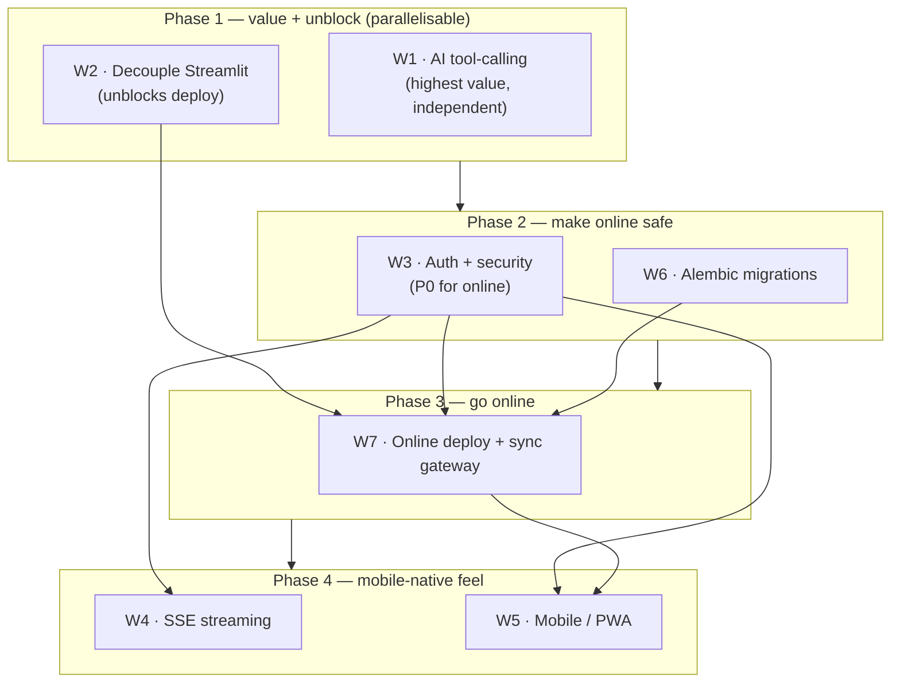

# TradeLogger — Web / Mobile / Online Platform Plan

*Planning document. No code yet. Written 2026-09-07.*

The goal: take TradeLogger from a **localhost research/journal terminal** to a
**private, online, mobile-usable** one — reachable from a phone, authenticated,
always-on for data collection — **without** changing what the system fundamentally
is or weakening any safety invariant.

This plan supersedes the ad-hoc "System Architecture & Web Gap Analysis" note:
several items in that note are already done (see Appendix A), and its framing as
an *institutional multi-user execution platform* is wrong for a solo operator.

---

## 0. Non-negotiable guardrails (these do not change)

| Invariant | Stays true |
|---|---|
| **Read-only** | No `POST /orders`, no order modify/cancel, no broker transmission. `LIVE_AUTOMATION_ENABLED = False`, `LIVE_BROKER_TRANSMISSION = "BLOCKED"`. Going online must not add an execution path. |
| **Frozen execution/research layer** | `PHASE_21_XAUUSD_STRATEGY_CONTRACT.md` + the sealed holdout stay byte-immutable and unread. No workstream here touches `execution_pipeline`, `risk_gateway`, `broker_adapter`, or the frozen contracts. |
| **Never fabricate** | Missing data stays `INSUFFICIENT_EVIDENCE` / `UNAVAILABLE`, never a made-up number. Applies to any new AI tool output too. |
| **Auth protects data, not trading** | There is nothing to "trade" through the API. Auth exists so private financial history isn't world-readable once the port is exposed. |

---

## 1. Current state (what this plan builds on)

Already shipped (recent sessions), so the plan starts here:

- **Interactive candlestick chart** — `PriceChart.tsx` (lightweight-charts 4.2.3) on the Market page. Binance real-time for crypto, Yahoo delayed for FX/metals, liveness-labelled.
- **Manual broker sync** — "Sync now" button + auto-sync toggle on the Positions header (`/api/system/sync`).
- **MT5 retired from the web** — env-only opt-in (`MT5_ENABLED=1`), dormant by default. The web no longer needs a running `terminal64.exe`. Capital.com is the live account link.
- **Macro data** — FRED coverage expanded (PPI, JOLTS, industrial production, durable goods, housing starts); ForexFactory calendar + upcoming consensus; cross-asset scorecard (DXY, US10Y, JP225, BTC, ETH); seasonality via a 10y daily candle backfill.
- **Journal** — DB-backed, screenshot upload (in-DB), star ratings, free-standing notes, per-setup-tag track record, calendar day-panel integration.
- **AI assistant** — read-only, context cached + background-warmed (~1–2s replies), usage meter, model configurable (`gemini-3.5-flash`).
- **DB** — Supabase Postgres (`is_postgres() == True`), pooled, SQLite fallback.

---

## 2. Workstreams

Seven workstreams. Each is independently shippable; §3 gives the recommended order.

Effort scale: **S** ≈ up to a day · **M** ≈ 2–4 days · **L** ≈ 1–2 weeks.

---

### W1 — AI Assistant: tool-calling (dynamic queries)

**Status: SHIPPED (2026-09-07).** SDK migrated to `google-genai`; 5 read-only
allowlisted tools live (`query_trades`, `analytics_period`, `tag_record`,
`macro_scorecard`, `journal_search`) via `api/ai_tools.py`; manual tool loop in
`api/gemini_client.generate()` (max 4 rounds, then a forced text answer);
per-call audit (`tool_calls: [{tool, args, ms, ok}]`) surfaced in the chat UI as
a "Looked up:" chip row. `run_backtest` deferred (D8). Tests:
`tests/test_stage16_ai_tools.py` + updated `test_stage15c`.

**Why.** Today the assistant answers only from a fixed context snapshot. It
cannot answer *"my average loss on GBPUSD during the London session"* or
*"run a 20-trade backtest on USDJPY"*. This is the single highest-value upgrade —
it turns the assistant from a summariser into something you actually reach for.

**Scope.**
- Enable Gemini function-calling (works on `gemini-3.5-flash`; needs a bump to the
  newer SDK — `google-genai`, since `google.generativeai` is deprecated).
- Define a small set of **read-only, allowlisted tools**, each a thin wrapper over
  code that already exists:
  1. `query_trades(symbol?, session?, direction?, tag?, date_from?, date_to?)` → filtered closed-trade stats (n, win%, expectancy, avg win/loss).
  2. `tag_record(tag)` → the per-tag track record (already an endpoint).
  3. `macro_scorecard(instrument)` → the EdgeFinder scorecard for an instrument.
  4. `run_backtest(strategy, symbol, timeframe, params?)` → the existing backtester, offline path only, capped runtime.
  5. `analytics_period(window)` → performance over day/week/month/quarter.
  6. `journal_search(query)` → full-text over notes / entries.
- Each tool: validates inputs, has a hard timeout, returns structured JSON, and
  **cannot write, execute, or reach the broker**. The tool registry is a
  hard allowlist — the model cannot call anything not on it.
- A short audit line per tool call (tool + args + duration) in the response meta
  so you can see what it did.

**Key decisions.**
- Migrate to `google-genai` SDK now (needed for clean function-calling + it's the
  only supported one). Contained change to `api/gemini_client.py`.
- Tool budget: start with the 6 above; add on demand.
- `run_backtest` is the risky one (slow, wide surface) — gate it behind a
  per-conversation call cap and a timeout, or ship W1 without it first.

**Effort.** M (SDK migration S + 6 tools M).
**Risk.** Low for read tools. Backtest tool needs guardrails. No safety-invariant risk.
**Depends on.** Nothing. Can start immediately.

---

### W2 — Retire Streamlit (D1: retire)

**Status: SHIPPED (2026-09-07).**
- **W2a** (`2a523cc`): `api.main` imports/serves with `streamlit` un-importable
  — `user_preferences.py` is streamlit-free; `trading_workspace_cockpit.py` +
  `market_intelligence_command_center.py` guard `streamlit` / `ui_components` /
  `tradingview_widget` / `workspace_layout_manager` as optional.
- **W2b**: `app.py` deleted. `streamlit` + `plotly` moved to
  `requirements-streamlit-legacy.txt` (prod installs `requirements.txt` only).
  The 8 pure-view modules kept but LEGACY-bannered, imported by nothing shipped.
  24 Streamlit-coupled tests → `tests/legacy_streamlit/` (auto-skips at
  collection without `streamlit`; still pass with the legacy extra). Guard test
  `tests/test_stage17_no_streamlit.py` boots `api.main` in a subprocess with
  `streamlit`+`plotly` blocked. Collection errors dropped from ~51 to 0.
  Retirement doc §13 records it.

**Why.** `import api.main` transitively imports `streamlit` (via
`routers/{market,watchlist,preferences,intelligence}.py` →
`trading_workspace_cockpit` / `user_preferences` /
`market_intelligence_command_center` → `ui_components` / `tradingview_widget`).
The FastAPI server will not boot without `streamlit` installed — a Linux/deploy
blocker (W7). D1 says the Streamlit terminal is replaced by the React SPA, so:

**Scope (revised for retire).**
1. **Extract** the pure, view-free logic the API actually calls into new
   streamlit-free core modules:
   - `TradingWorkspaceCockpit` data methods + `WATCHLIST_SYMBOLS` → a
     `watchlist_data`-style module.
   - `UserPreferencesManager` + `DEFAULT_PREFERENCES` → a prefs-store module.
   - `UnifiedMarketIntelligenceAggregator` (+ the names `routers/intelligence.py`
     pulls) → a market-intelligence-core module.
   Verify none of the extracted methods actually reference `st.` (they are
   data/aggregation classes that merely *live* in a streamlit file).
2. Repoint every `api/` import to the new core modules.
3. Add a test: `import api.main` with `streamlit` un-importable (monkeypatch
   `sys.modules['streamlit'] = None`) → must still succeed, and the key
   endpoints (`/api/watchlist`, `/api/preferences`, `/api/market/*`,
   `/api/intelligence/*`) must still 200.
4. **Delete** `app.py` + the Streamlit-only files (`ui_components.py`,
   `tradingview_widget.py`, `command_palette.py`, `keyboard_shortcuts.py`,
   `workspace_layout_manager.py`, `market_intelligence_ui.py`,
   `asset_edge_scorecard.py`, `forward_evidence_cockpit.py`, the Streamlit
   shells of the three extracted modules) once nothing imports them. Delete or
   port the ~7 `tests/test_phase6x_*` Streamlit UI tests.
5. Move `streamlit` out of `requirements.txt` (drop it entirely, or a
   `requirements-legacy.txt`). Finish
   `docs/STAGE_11_STREAMLIT_RETIREMENT_EVALUATION.md`.

**Effort.** M. Do it in two commits: **W2a extract + repoint + boot test**
(reversible, no deletions), then **W2b delete the Streamlit files**.
**Risk.** Low–medium. The extract is mechanical; the deletion is large but comes
after the boot test proves the API no longer needs any of it.
**Depends on.** D1 (answered). Should land before W7.

---

### W3 — Authentication, sessions & security hardening

**Status: SHIPPED (2026-09-07).** `api/auth.py` + `api/routers/auth.py` + an
`@app.middleware("http")` gate in `api/main.py`. Single passphrase → scrypt hash
in `TL_AUTH_PASSWORD_HASH` (or plaintext `TL_AUTH_PASSWORD`, hashed at boot);
`python -m api.auth` generates the hash. Login mints an opaque
`secrets.token_urlsafe` token, stored SHA-256 only in a `sessions` table
(default 30-day TTL, revocable). Rides in an httpOnly `tl_session` cookie or an
`Authorization: Bearer` header. Every `/api/*` route is gated except
`/api/health`, `/api/auth/*`, and the OpenAPI docs. Per-IP login rate-limit
(5 tries / 15 min lockout). CORS reads `TL_ALLOWED_ORIGINS` (credentials only
with an explicit list). **With no passphrase configured, auth is disabled and
nothing changes** — local dev + the whole test suite are unaffected. Frontend:
`AuthProvider` + `<AuthGate>` in `main.tsx` → `<LoginScreen>` when locked; a
401 from any call bounces back to it; "Sign out" in the top bar. Break-glass:
`TL_AUTH_DISABLED=1`. Tests: `tests/test_stage18_auth.py` (17).
2FA (D6) and Cloudflare Access (D4) are additive layers, not yet built.

**Why.** With the port reachable from the internet, anyone who finds it can read
every trade, P&L figure, and journal note. This was a **P0 blocker for going
online**. (There was no `APP_PIN` in the codebase — auth was simply absent.)

**Scope.**
- **Auth model — single-user, token-based** (not multi-user; there is one of you):
  - A login endpoint that takes a strong passphrase (replaces the 4-digit PIN),
    returns a signed **JWT** (short-lived access token + refresh token, or a long
    opaque session token — decide in §4).
  - `Authorization: Bearer` middleware on every `/api/*` route except `/api/health`
    and the login route.
  - React: an auth context, a login screen, token in memory + refresh in an
    httpOnly cookie, 401 → bounce to login.
- **Transport** — HTTPS only once online (handled by the host / a reverse proxy;
  see W7). No plaintext auth over the internet, ever.
- **Rate limiting** — a simple in-process limiter on the login route (lockout after
  N failures) and a global soft cap. Full WAF is overkill.
- **Secrets** — audit that no endpoint ever returns an API key / token (the macro
  providers panel already redacts; re-verify after W1's tool outputs).
- **CORS** — lock `allow_origins` to the known frontend origin(s) once deployed.
- Optional: **2FA (TOTP)** on login — cheap to add, meaningful for a finance app
  on the public internet.

**Key decisions (see §4).** JWT vs opaque session token; token lifetime; 2FA yes/no;
where the passphrase hash lives (env var of a bcrypt/argon2 hash, or a `users` row).

**Effort.** M.
**Risk.** Medium — auth bugs lock you out or leave a hole. Mitigate with tests for
every route (401 without token, 200 with) and a documented recovery path
(env-var break-glass).
**Depends on.** Decide before W7. Independent of W1/W2.

---

### W4 — Real-time streaming (WebSocket / SSE)

**Why.** Watchlist / positions / prices refresh via 5–30s polling with
`AbortController`. For a *read-only research* tool this is genuinely fine — but on
mobile, many short polls are worse for battery and flaky networks than one held
connection, and multiple tabs multiply the traffic. This is a **nice-to-have that
becomes more attractive on mobile**, not a correctness fix.

**Scope.**
- A single **SSE** endpoint (`GET /api/stream`) that pushes: price ticks for
  watchlist symbols, position P&L updates, alert fires, sync-cycle completion.
  SSE over WebSocket because: one-directional (server→client is all we need),
  works through proxies trivially, auto-reconnects, far simpler.
- Server side: one background task fans out updates to connected clients; the
  existing polling endpoints stay as the fallback and for first paint.
- React: a `useEventStream` hook; pages subscribe to the slices they care about;
  falls back to polling if the stream drops or isn't available.
- Auth: the stream endpoint takes the same bearer token (query param or header).

**Key decisions.** SSE vs WebSocket (recommend SSE). Whether to also stream the
candle chart's last price (nice, small).

**Effort.** M.
**Risk.** Low. Purely additive; polling stays as the floor.
**Depends on.** W3 (the stream must be authed). Not a blocker for anything.

---

### W5 — Mobile / PWA

**Status: mostly SHIPPED (2026-09-07), out of order** — the user asked to pause
deployment (W6/W7) and focus on the website.
- **PWA shell** (`b7e0521`): `manifest.webmanifest` (standalone, dark theme),
  icon set from the favicon (192/512/512-maskable/180-apple), `public/sw.js`
  (network-first navigations + stale-while-revalidate for hashed assets, never
  caches `/api/*`), registered in production builds only. Verified installable.
- **Responsive pass** (`eb653ee`): a bottom 4-zone nav bar (`<BottomNav>`,
  `lg:hidden`, safe-area aware — D9's recommendation), TopBar compacted on
  phones, `PageContainer` action slot no longer overflows, the 7-column
  economic-calendar table scrolls horizontally. 0 horizontal page overflow
  verified at 390px across ~9 pages. Prior sessions had already done most table
  `overflow-x-auto` + the off-canvas drawer sidebar.
- **Still to do:** a deeper per-page polish pass (open-ended); **Web Push**
  (D10) — deferred.

**Why.** "Go mobile" = usable on a phone browser and installable to the home
screen, working on cellular. The app is a React SPA already, so this is mostly a
responsiveness + PWA-shell pass, not a rewrite.

**Scope.**
- **Responsive audit** — every one of the ~26 pages at 375–430px width:
  tables → card/stack layouts or horizontal scroll containers; the calendar grid;
  the candle chart (touch pan/zoom, sensible default height); nav → a bottom bar
  or drawer on small screens; the AI chat composer.
- **PWA shell** — `manifest.webmanifest` (name, icons, theme colour, `display:
  standalone`), a service worker that caches the app shell for instant load and
  offline "last seen" rendering (data still needs the network — no offline
  writes).
- **Web Push (optional, later)** — a service-worker push subscription so alert
  fires reach you when the tab is backgrounded / phone is locked. Needs VAPID keys
  and a `POST /api/push/subscribe` endpoint storing the subscription per session.
  *In-window audio chimes are explicitly out of scope (your call).*
- **Touch/ergonomics** — larger tap targets, no hover-only affordances (the
  InfoTip tooltips already handle tap), pull-to-refresh where it makes sense.

**Key decisions.** Bottom-nav vs hamburger on mobile. Whether Web Push is in this
round or a follow-up. Icon/splash art.

**Effort.** L (responsive pass is the bulk; PWA shell is S; Web Push is M).
**Risk.** Low. Cosmetic/additive. The risk is scope creep in the responsive pass —
timebox it page-by-page.
**Depends on.** W3 for Web Push. The responsive pass depends on nothing.

---

### W6 — Alembic schema migrations

**Status: SHIPPED (2026-09-07).** `alembic.ini` + `alembic/env.py` +
`alembic/versions/0001_baseline_*.py`. `alembic` added to `requirements.txt`
(pulls SQLAlchemy — used only as the migration runtime, no ORM models). `env.py`
reads the DB URL from `database.get_db_url()` (single source of truth with the
app; the Supabase URI never enters `alembic.ini`) or an `ALEMBIC_DATABASE_URL`
override; **Postgres-only** — it refuses to run on the SQLite/pytest path. The
existing at-boot `CREATE TABLE IF NOT EXISTS` / per-module table creation is
kept as the fresh-DB bootstrap; Alembic owns only *structural* changes
(renames, type/constraint changes, drops, backfills). `0001_baseline` is a
deliberate no-op marker. Deploy: `alembic stamp 0001_baseline` once on the live
Supabase DB, then `alembic upgrade head` in the update routine (`docs/DEPLOY.md`
§6, rewritten from stub). Tests: `tests/test_stage19_migrations.py` (6).

**Why.** Schema changes today are scattered `CREATE TABLE IF NOT EXISTS` /
`ALTER TABLE ... ADD COLUMN IF NOT EXISTS` blocks across many Python files, run at
boot. That works for additive changes but can't do renames, constraint changes,
data backfills, or rollbacks — and there's no record of what shape the DB is
*supposed* to be in.

**Scope.**
- Initialise Alembic against the current Supabase schema (autogenerate a
  baseline "0001_initial" from the live DB, mark it as applied).
- Move future schema changes into versioned migrations; keep the boot-time
  `CREATE TABLE IF NOT EXISTS` as a safety net for fresh local SQLite only, or
  retire it once migrations are the single source of truth.
- A `alembic upgrade head` step in the deploy process (W7).
- Document the baseline schema (supersedes hand-maintained `docs/02_Database_Schema.md`).

**Key decisions.** Do migrations run automatically on deploy or manually? (Recommend
manual for the first few, automatic once trusted.) SQLite-fallback support in
migrations (SQLite's ALTER is limited) — probably declare Postgres-only for
migrations and keep SQLite as best-effort local dev.

**Effort.** M.
**Risk.** Medium — a bad migration on the live DB is painful. Mitigate: always
`--sql` preview first, take a Supabase backup before each, test on a copy.
**Depends on.** Nothing, but most valuable *before* W7 so deploys have a clean
schema step.

---

### W7 — Deployment: online hosting + always-on sync gateway

**Status: SHIPPED (2026-09-08).** Live at
`https://trade-logger.tesbonnathyrak.workers.dev` (frontend) →
`https://tradelogger-api.onrender.com` (API) → Supabase.
- **Frontend:** Cloudflare Workers static assets (`wrangler.jsonc`,
  `not_found_handling: single-page-application` for the SPA fallback;
  `frontend/.env.production` bakes `VITE_API_BASE_URL`). Auto-deploys on push.
- **Backend:** Render free web service (`render.yaml` Blueprint; Python 3.14.3;
  `TL_SKIP_WARMUP=1`, `DB_POOL_ENABLED=0`). Sleeps after 15 min idle,
  ~50 s cold-start wake. Auto-deploys on push.
- **No always-on gateway** — the "always-on sync loop" requirement was removed
  by the *sync-on-open* change (`e9f49bf`): the frontend calls
  `/api/system/sync/run-if-stale` on load. Manual **Sync now** stays.
- **Cross-site auth:** `TL_AUTH_COOKIE_SAMESITE=none` + `TL_ALLOWED_ORIGINS`
  set to the Workers origin. Using plaintext `TL_AUTH_PASSWORD` on Render (the
  scrypt hash paste was error-prone); can move back to `TL_AUTH_PASSWORD_HASH`.
- **Migrations:** run locally against the prod `DATABASE_URL` (Render free has
  no shell). DB stamped `0001_baseline`.
- Full walkthrough + the free-tier caveats: `docs/DEPLOY.md`.
- **Not done (optional):** uptime pinger to keep it warm; Cloudflare Access as
  a second lock; a custom domain.

**Why.** Two separate problems bundled:
1. **Serve the app online** — a URL you can open from your phone, over HTTPS, authed.
2. **Keep data collection running** when your PC is asleep — the auto-sync loop
   (Capital.com reconciliation, macro/calendar refresh, candle ingestion) needs a
   host that's always on.

**Scope.**
- **App hosting.** The backend is Linux-friendly *once W2 lands* (MT5 is already
  retired). Options, cheapest-first:
  - A small always-on Linux VPS (Hetzner / Fly.io / Railway / a $5–10 box):
    runs `uvicorn api.main:app` behind Caddy/nginx for HTTPS + a real domain,
    plus the `auto_sync` loop as a systemd service. Frontend served as static
    files by the same reverse proxy or a CDN (Cloudflare Pages / Netlify).
  - Managed (Render / Railway / Fly.io) — less ops, slightly more $, HTTPS + deploy
    hooks for free.
- **Database.** Already Supabase (cloud) — no change; just make sure the VPS can
  reach it and secrets are set as env vars, not committed.
- **The sync gateway.** After W2 this is a plain Linux process. Run it *on the same
  VPS* as the API (simplest) — one host, one deploy, `auto_sync` as a service.
  No Windows VPS needed anymore (that was an MT5 constraint).
- **Secrets & config.** A single `.env` on the host (never in git), or the host's
  secret manager. Rotate the Gemini / Capital / FRED / FMP keys as part of going
  live.
- **Backups.** Supabase has automated backups; confirm the retention and add a
  weekly `pg_dump` to object storage for belt-and-braces.
- **Observability.** A basic uptime check (UptimeRobot / healthchecks.io hitting
  `/api/health`) and log shipping or at least `journalctl` access.

**Key decisions (see §4).** VPS vs managed host; domain name; Cloudflare in front
(free HTTPS + basic DDoS + access rules) yes/no; does the local PC still run
anything, or is the VPS now the only home.

**Effort.** M–L (M if managed host, L if self-managed VPS + reverse proxy + systemd).
**Risk.** Medium — this is where "exposed to the internet" becomes real. W3 (auth)
**must** be done first. Cloudflare Access in front is a strong cheap extra layer
(only your Google/email can reach the origin at all).
**Depends on.** **W2** (Linux-clean backend) and **W3** (auth) are hard
prerequisites. W6 strongly recommended first.

---

## 3. Sequencing

**Recommended order:**

1. **W1** (AI tool-calling) — biggest day-to-day value, blocks nothing, start now.
2. **W2** (decouple Streamlit) — do it while the coupling is only ~3 files; unblocks W7.
3. **W3** (auth) — the gate. Nothing goes online before this.
4. **W6** (Alembic) — so W7 has a clean schema step.
5. **W7** (deploy) — the actual "online" milestone.
6. **W4 + W5** (streaming + mobile polish) — once it's online and authed, make it feel native on a phone.

W1 and W2 can run in parallel. W4 and W5 can run in parallel after W7.

---

## 4. Open decisions

### Answered (2026-09-07)

- **D1 — Streamlit terminal → RETIRE.** The React SPA replaces it. W2 is now
  *extract the pure logic the API needs into streamlit-free core modules, then
  delete `app.py` + the Streamlit-only UI files*. `streamlit` moves to an
  optional dependency. See W2 below (revised).
- **D2 — Hosting → must be a free option.** Free tiers that can run an
  *always-on* process (the sync gateway needs this — Render's free web service
  sleeps after 15 min idle and is unsuitable):
  - **Oracle Cloud Always Free** — a genuine always-on ARM VM (up to 4 vCPU /
    24 GB on the Ampere free allotment), no time limit. Best fit; more setup.
  - **Google Cloud free `e2-micro`** — one small always-on VM, us-regions only.
  - **Fly.io** — small always-on VMs within a limited monthly free allowance.
  - Frontend: **Cloudflare Pages / Netlify** free static hosting.
  - Supabase (DB) already has a free tier. → leaning **Oracle Cloud Always Free
    VM + Cloudflare Pages**; revisit at W7.
- **D5 — auth: single-user now, but MULTI-USER is planned ("publish it for
  other users too").** This is a scope change — the plan had multi-user out of
  scope. Implications, to plan properly before W3:
  - Auth needs registration / login / per-user sessions (a `users` table +
    `sessions` table; opaque session tokens still work and stay revocable).
  - Every data table needs a real `owner_id` and every query a tenant filter —
    today `account_id` is broker-scoped, not user-scoped. This is the big one.
  - The frozen research/execution layer and the sealed holdout stay shared and
    read-only — they are not per-user.
  - Rate limiting, abuse handling, and cost (AI tokens, data providers) all
    change when strangers can sign up.
  - **Recommendation:** ship **single-user opaque-session auth** for W3 to get
    online safely, and treat "multi-tenant" as a separate later workstream (W8)
    with its own plan — do **not** block going online on it.

| # | Decision | Options / notes |
|---|---|---|
| D3 | **Domain** | Buy a domain (`something.app` / `.trade` / `.xyz`) or use the host's subdomain. A real domain is ~$10–15/yr and makes HTTPS + Cloudflare clean. |
| D4 | **Cloudflare in front?** | Free tier gives HTTPS, caching, basic DDoS, and **Cloudflare Access** (only your email can reach the origin — a second auth layer for near-zero effort). Recommendation: **yes**. |
| D5 | **Auth token style** | Short-lived JWT + refresh (stateless, standard) vs one long opaque session token in an httpOnly cookie (simpler, revocable). Recommendation: **opaque session cookie** for a single-user app — simpler and revocable. |
| D6 | **2FA (TOTP)** | Adds a phone-authenticator step to login. ~half a day. Recommendation: **yes**, given it's finance data on the public internet. |
| D7 | **Does the local PC still do anything?** | Once the VPS runs everything, the PC becomes just a dev box. Confirm nothing local is load-bearing (it isn't, after MT5 retirement). |
| D8 | **`run_backtest` AI tool in W1 v1?** | Include (powerful, needs a runtime cap) or defer to W1 v2. Recommendation: **defer** — ship the read tools first. |
| D9 | **Mobile nav pattern** | Bottom tab bar (app-like) vs hamburger drawer. Recommendation: **bottom bar** for the 4 zones + a "more" sheet. |
| D10 | **Web Push in W5 or later?** | Push needs VAPID keys + a subscription table + the SW. Recommendation: **later** — ship the responsive + installable PWA first, add push as a follow-up. |

---

## 5. Explicitly out of scope

- **In-window audio chimes / HTML5 `<audio>` alerts** — your call, descoped.
- **Live order submission / modification / cancellation** — permanent design block.
- **Un-freezing or re-reading the sealed holdout / strategy contract.**
- **Reviving MT5 as a web dependency** — stays env-only opt-in.
- **Multi-user / multi-tenant** — *deferred, not cancelled* (D5: the user plans
  to publish it for others). Tracked as **W8** below. It is a separate
  workstream with its own plan and must not block W3→W7 (going online for one
  user).

---

### W8 — Multi-tenant (W8.1–W8.7 SHIPPED 2026-09-09)

All seven phases are on `main`. Inert until `TL_AUTH_MODE=supabase` +
`VITE_AUTH_MODE=supabase`. See `docs/DEPLOY.md` §10 for the switch-on steps.
W8.1 identity (`api/identity.py`, dual-mode gate). W8.2 frontend Supabase
sign-in. W8.3 Alembic `0002`/`0003` (`user_id` column + owner hand-over).
W8.4 `tenant.py` context var + every journal table / query scoped. W8.5
`api/broker_credentials.py` (Fernet) + `/api/connections` + ConnectionsPage.
W8.6 per-user sync (`sync_service.run_for_user`, `user_settings`). W8.7
owner-only `/api/admin/users`, deny-cache, docs.

---

### W9 — MT5 push agent (SHIPPED 2026-09-09)

MetaTrader brokers (Exness, prop firms) can't reach the Linux host — the
`MetaTrader5` lib is terminal-local. A friend runs `agent/mt5_push_agent.py`
on their Windows PC; it reads MT5 and POSTs to `POST /api/ingest/mt5`
(auth-gated, dual-mode, no order path). `mt5_ingest.py` holds the shared
transform/reconstruct half (extracted from `mt5_sync.py`, which now calls it);
ids from a non-`local` tenant are prefixed `"<uid>:<account>_..."` so friends
with the same MT5 login on different brokers never collide. Agent auth =
Supabase password grant (or the shared passphrase). Setup + a Task Scheduler
installer (`register_task.ps1`) in `agent/README.md`. See `docs/DEPLOY.md` §11.
Tests: `test_stage25_mt5_ingest.py`.

---

### W10 — native email + password auth (SHIPPED 2026-09-10)

Supabase Auth was dropped after it blocked the switch-on three times (DB egress
cap, then auth egress cap, then the 2-free-projects-per-account limit).
Identity is now **first-party**: `TL_AUTH_MODE=multiuser` → sign-up / sign-in
against the `users` table (scrypt via `api/auth`), an opaque session token in
the same httpOnly cookie the passphrase gate uses (`sessions.user_id` ties it
to an account), invite-only via `TL_SIGNUP_ALLOWLIST` + `TL_OWNER_EMAIL`. No
external service, no JWT, no keys to rotate — everything on Neon.

Backend: `identity.create_account / verify_credentials / resolve_session_user`;
`auth.session_user` + `create_session(user_id=)`; `_auth_gate` gets a
`multiuser` branch; `POST /api/auth/signup` + `/login` (now takes `email`,
returns `token` in the body for the MT5 agent) + `/me` + `/status`. Supabase
mode (W8) kept as a dormant legacy path. Alembic `0004` (password_hash,
sessions.user_id — no-op if app booted first). Frontend: `MultiUserAuthProvider`
(cookie-based, no client token, no supabase-js — dependency removed),
`VITE_AUTH_MODE=multiuser`, `src/lib/supabase.ts` reduced to a mode flag.
Agent: `Auth` posts email+password to `/api/auth/login`, uses the returned
token; `CONFIG_DEFAULTS` no longer carries Supabase values. Tests:
`test_stage28_native_auth.py` (14). `docs/DEPLOY.md` §10 rewritten.

**Switch-on = 3 Render env vars** (`TL_AUTH_MODE=multiuser`, `TL_OWNER_EMAIL`,
`TL_SIGNUP_ALLOWLIST`) + `VITE_AUTH_MODE=multiuser` (already in
`.env.production`) + sign up as owner + `alembic upgrade head`.

---

### W11 — friends-tier nav rework, monetization surfacing, MT5 agent polish, rebrand (SHIPPED 2026-09-14)

Smaller follow-on polish after W8–W10, all user-driven fixes/requests rather
than a single planned workstream:

- **Nav** (`frontend/src/lib/navigation.ts`): friends build swaps **Price
  Alerts** out of the workspace zone for **Command Center, Market, Risk
  Gateway** (`friendsVisible` flags only — routing/sidebar/palette all derive
  from the filtered list already).
- **Partners page** (`frontend/src/pages/PartnersPage.tsx`,
  `/operations/partners`) — the 5ers affiliate link + referral-bonus claim
  card (shipped earlier this session as a card at the bottom of Connections)
  gets its own nav entry; it was getting missed where it lived. Connections
  keeps a pointer link to it.
- **Analytics starting-balance persistence** — `POST
  /api/analytics/initial-balance`, tenant+account-scoped via the existing
  `app_settings` table; fixes a real bug (typed value reset to 10000 on
  every reload). `tests/test_analytics_saved_balance.py`.
- **AI Assistant kill switch** — `TL_AI_ASSISTANT_ENABLED=0` on the
  production Blueprint (`render.yaml`); local/dev unaffected
  (`api/gemini_client.py::is_configured()`).
- **MT5 agent (`agent/mt5_push_agent.py`, now v1.3.0) — two real bugs**:
  (1) it was auto-popping MetaTrader open in the foreground every 15-minute
  sync when the terminal was closed — fixed by minimizing the newly-launched
  window (Win32 `SW_MINIMIZE`, watched for on a background thread) instead of
  either leaving it in the foreground or skipping the sync; verified live via
  `IsIconic()` on both source and the rebuilt `.exe`. (2) uninstalling only
  ever worked via a `--uninstall` CLI flag — added a real double-clickable
  `Uninstall TradeLogger Sync.bat`, self-healing on every run.
- **Gold/black/gray rebrand, app icon pass** — the app UI's rebrand (tokens,
  fonts, WCAG-fixed buttons, restrained glow) happened earlier in the same
  session; this added the missing piece — `frontend/public/{favicon,
  icon-192,icon-512,icon-maskable-512,apple-touch-icon}.png` recolored from
  the old teal/blue candlestick mark to gold/gray-on-black (procedurally
  generated, Pillow), plus `manifest.webmanifest` + `index.html` `theme-color`
  meta brought off their stale pre-rebrand values.
- **Open signup switch** (`api/identity.py`) — `TL_SIGNUP_OPEN=1` bypasses
  `TL_SIGNUP_ALLOWLIST` entirely so anyone can create an account; off by
  default (`render.yaml` bakes in `"0"`, deliberately never `"1"` there —
  flip it by hand in the Render dashboard when actually ready, so a
  blueprint re-sync can't do it either way). Since the allowlist stops
  doing its abuse-prevention job the moment this is on, a separate per-IP
  cap (`signup_rate_limited_for`/`record_signup`, `TL_SIGNUP_MAX_PER_IP`
  default 2 per `TL_SIGNUP_WINDOW_HOURS` default 24) takes over — counts
  *successful* signups and never resets on one, unlike the existing
  `auth.rate_limited_for` login limiter it deliberately doesn't reuse (that
  one only counts failures and a success wipes it clean, which is backwards
  for "stop one person minting accounts"). `/api/auth/status` and `/me`
  expose `signup_open` so `LoginScreen.tsx`'s "Invite-only" tagline is only
  shown when it's actually true. `tests/test_open_signup.py` (10 tests).
- **Custom domain** — `tradelogger.site` (registered at Hostinger) attached as
  a Cloudflare Custom Domain on the `trade-logger` Worker; nameservers moved
  to Cloudflare, stale parking A/CNAME records cleared, `TL_ALLOWED_ORIGINS`
  on Render updated to include it. The original
  `https://trade-logger.tesbonnathyrak.workers.dev` still resolves to the
  same Worker and keeps working. SEO baseline added alongside it:
  `index.html` meta description + canonical + Open Graph/Twitter cards (new
  1200x630 `og-image.png`) + JSON-LD, plus `robots.txt`/`sitemap.xml`.
- **Chart Analyzer** (`/workspace/chart-analyzer`, `POST
  /api/ai/chart/analyze`) — upload a chart screenshot or paste a
  `tradingview.com/x/...` share link (fetched server-side, host-validated
  twice: the share link and the og:image URL it names) and Gemini vision
  reads what's visibly plotted — entry/stop/target, symbol, timeframe,
  pattern/confluences — plus gives a 1-10 setup-quality opinion. Same
  security posture as the AI Assistant (`api/chart_analysis.py`: no import
  of / path to execution, broker or order code; pure image-in, JSON-out).
  R:R is computed server-side from entry/stop/target, never trusted from the
  model's own arithmetic; every field the model isn't confident reading
  comes back `null` rather than guessed. Nothing is persisted — ephemeral,
  one-shot analysis, no DB table. `tests/test_chart_analysis.py` (21 tests).
- **Challenge Tracker** (Analytics page, `/api/challenge/*`,
  `api/challenge.py`) — per-account prop-firm evaluation tracking: phase
  progress bar (gain vs. target $), a drawdown-budget gauge (trailing-from-
  peak or static-from-initial-size, user-selectable — the5ers.com's own
  explainer doesn't specify which High Stakes actually uses, so this is
  labelled an estimate, never presented as authoritative), a daily-loss
  gauge that resets each day, and a profit-day counter against a
  configurable per-day % threshold. Defaults match a 5ers $5,000 High Stakes
  2-step (Phase 1 +10%, Phase 2 +5%, 10% max drawdown, 5% daily loss, 3 min
  profit days) but every number is editable for any firm/size. Config is a
  JSON blob in the existing `app_settings` table, scoped by tenant+account
  exactly like the saved-initial-balance feature; phase advance/reset are
  manual buttons (no auto-detection of a pass/fail). Pure read/compute over
  `get_closed_trades` + `get_account_balances` — no execution path.
  `tests/test_challenge.py` (14 tests).
- **Journal split by account** (`JournalPage.tsx`) — an account filter
  (dropdown, persisted to localStorage) when more than one account has
  closed trades; previously every account was mixed into one feed/table.
  Client-side filter over the already-fetched `JournalResponse` (which
  already carried `account_id` per entry and the accounts list), recomputing
  the summary totals for the selected account. A calendar deep-link
  (`?trade=`) still resolves even if it belongs to a filtered-out account.
- **Chart Analyzer → Journal linking** — a "Save to Journal" panel after a
  finished analysis: attach it to a real closed trade (screenshot + a notes
  append, picked from a filterable trade list) or save as a free-standing
  note when it's just an analyzed setup, not a trade taken. Required
  `ChartAnalysisResponse` to start echoing back `image_base64`/`image_mime`
  (`api/routers/ai.py`) since the TradingView-link path never gave the
  browser the image bytes in the first place.
- **Pre-Trade Checklist** (`/workspace/pre-trade-checklist`) — fill out a
  plan *before* entering (symbol/direction/setup tag, entry/SL/TP with a
  live R:R calc, a thesis, and a fixed 6-item honesty checklist — not a
  gate, nothing blocks saving regardless of what's checked) and save it to
  the Journal, optionally showing the selected account's live Challenge
  Tracker budgets (drawdown/daily-loss % used) as a standing reminder while
  planning. Needed a 4th journal-entry kind, `"plan"`
  (`_JOURNAL_ENTRY_KINDS` in `api/schemas.py`; no DB migration — the column
  is unconstrained TEXT). `SaveToJournal.tsx` (used by both this and Chart
  Analyzer) was generalized from a chart-analysis-specific component into a
  plain `{description, defaultKind, defaultInstrument, defaultTitle,
  imageBase64?, imageMime?}` one, moved from `components/chartAnalyzer/` to
  `components/journal/`. `tests/test_journal_entries.py` (3 tests) — the
  free-standing journal-entries endpoint had no prior direct test coverage
  at all (only the per-trade PATCH and screenshot routes did).
- **Glass-card consistency polish** — Chart Analyzer and Challenge Tracker
  were built with flat `bg-surface`/`border-border` panels; the app already
  has one canonical frosted-glass card (`SectionCard`, defined once in
  `components/intelligence/primitives.tsx`, re-exported from
  operations/research/evidence primitives and used by most of the rest of
  the app — Command Center, Analytics' own charts, Journal, System Health).
  Converted both onto it; no behavior change.
- **Killzone Scanner** (`/workspace/killzone-scanner`, `GET
  /api/scanner/killzone`, `killzone_scanner.py`) — flags candidate liquidity-
  sweep + market-structure-shift ("MSS") events, tags each with the ICT
  killzone window it fell in and whether its direction agrees with the
  higher-timeframe structural bias. Pattern-flagging only — every threshold
  (swing window, displacement-vs-ATR, sweep-to-shift candle gap) is a plain
  disclosed number, no hidden judgment call, and the response computes no
  win probability, recommendation, entry, or stop. Deliberately built from
  the *generic* primitives already in `market_data.py`
  (`calculate_market_structure`, `calculate_liquidity_zones`,
  `detect_active_killzone`, `detect_fvgs`, `get_realtime_candles`) — not the
  XAUUSD-specific frozen research engines (`xauusd_daily_command_center.py`,
  `trade_setup_engine.py`), which are a separate, closed research contract
  this module doesn't import. HTF bias is computed on 1h, not daily/4h — the
  shared Yahoo-backed candle fetch caps daily history too short for
  structure detection, and there's no true 4h available from it either (a
  "4h" request silently serves raw 1h bars, no resampling); 1h/15m is also a
  standard ICT bias/entry pairing on its own. `tests/test_killzone_scanner.py`
  (12 tests) — detection correctness against a hand-built synthetic candle
  series with a known, engineered sweep+shift, plus a network-tolerant live
  check that skips (not fails) if the upstream feed is unreachable.

---

### W8 — original plan (COMMITTED 2026-09-08)

**Why.** D5 — open TradeLogger to a handful of friends so each tracks their own
trades. Doing this properly is a workstream, not a W3 tweak.

**Decisions (2026-09-08).**
- **Auth:** Supabase Auth (free). Frontend uses `@supabase/supabase-js` for
  signup/login (email + password); backend verifies the project JWT (HS256,
  `SUPABASE_JWT_SECRET`) — no per-request network call. The single-passphrase
  mode stays as the local-dev / fallback path (`TL_AUTH_MODE` selects).
- **Signup gating:** `TL_SIGNUP_ALLOWLIST` env (comma-separated emails). The
  backend provisions a `users` row only for an allowlisted email; anyone else
  gets 403 even if they created a Supabase auth user. No invite table.
- **Broker credentials:** per-user, stored **encrypted at rest** (Fernet,
  `TL_CREDENTIAL_ENC_KEY`), one row per connection in `broker_connections`.
  Each user gets the same auto-sync the owner has. New dep: `cryptography`.
- **Shared vs per-tenant:** the frozen research/execution layer, sealed holdout,
  macro intelligence (FRED/CFTC/calendar), historical candles, correlation
  matrix, strategy/evidence research all stay **global and read-only**. Only the
  journal-side tables become per-user.
- **Audience:** friends only — invite-gated, no billing, no public signup,
  comfortably inside every free tier (Supabase 500 MB DB / 50k MAU, Render free,
  Cloudflare free).

**Per-user tables** (gain `user_id TEXT NOT NULL`): `raw_deals`,
`closed_trades`, `open_positions`, `account_metadata`, `price_alerts`,
`journal_entries`, `journal_screenshots`. Per-user settings move to a new
`user_settings(user_id, key, value)` table (sync heartbeat, `sync_auto_enabled`,
preferences); `app_settings` stays global. New: `users`, `broker_connections`.

**Phases (each = one PR / commit).**
- **W8.1 — Identity backend.** `users` table; `api/identity.py` verifies the
  Supabase JWT; allowlist provisioning (first-seen upsert, 403 if not listed);
  `_auth_gate` middleware becomes dual-mode and stashes `request.state.user_id`.
  Passphrase mode still the default. Tests: JWT valid/expired/wrong-secret,
  allowlist allow/deny.
- **W8.2 — Frontend auth swap.** `@supabase/supabase-js`; `src/lib/supabase.ts`;
  rewrite `src/lib/auth.tsx` for Supabase sessions; login + "create account" UI;
  `client.ts` attaches `Authorization: Bearer <access_token>` and refreshes once
  on 401. Selected by `VITE_AUTH_MODE`.
- **W8.3 — Schema migrations.** Alembic `0002` (users, user_settings,
  broker_connections), `0003` (add nullable `user_id` + indexes), `0004`
  (backfill existing rows to the owner), `0005` (set `user_id` NOT NULL). No
  behaviour change yet. Fresh-DB bootstrap `CREATE TABLE`s updated to match.
- **W8.4 — Data-layer tenant scoping.** Every `database.py` read/write for a
  per-user table takes `user_id` and filters/sets it; every route resolves the
  caller from `request.state.user_id`. `get_setting`/`set_setting` gain
  user-scoped variants. Tenant-isolation tests per route (user A must never see
  user B's rows). **The big phase.**
- **W8.5 — Broker credentials.** `api/broker_credentials.py` (Fernet encrypt /
  decrypt); `broker_connections` CRUD + "test" + "sync now" API
  (`api/routers/connections.py`); `src/pages/ConnectionsPage.tsx`. Refactor
  `capital_sync.sync_capital()` to take a credentials object instead of reading
  env (env kept as the owner's local fallback). Secrets never leave the server.
- **W8.6 — Per-user sync.** `sync_service` / `auto_sync` iterate active
  `broker_connections` per user; heartbeat + `sync_auto_enabled` move to
  `user_settings`; sync-on-open scopes to the caller. Syncs serialised for the
  512 MB Render box.
- **W8.7 — Hardening + review.** Signup rate-limit; minimal admin endpoint
  (list users, disable one); DEPLOY.md + env docs; user runs `/code-review
  ultra` on the branch before the URL is shared.

**One-time setup the user does (Supabase dashboard).** Enable the Email auth
provider; add the Cloudflare origin to redirect URLs; copy `Project URL`,
`anon` key (→ frontend `.env.production`, public) and `JWT secret` (→ Render
`SUPABASE_JWT_SECRET`, secret). Generate a Fernet key for
`TL_CREDENTIAL_ENC_KEY`. Set `TL_SIGNUP_ALLOWLIST` and `TL_OWNER_EMAIL` on
Render.

**Guardrails unchanged.** No order path is added. `LIVE_AUTOMATION_ENABLED`
stays `False`, `LIVE_BROKER_TRANSMISSION` stays `BLOCKED`. The frozen
contract / holdout is not touched. Broker credentials are used only for
Capital.com's read-only history endpoints.

**Depends on.** W3 + W6 + W7 (all shipped). **Effort.** L+ — multi-session.

---

## Appendix A — corrections to the prior "Gap Analysis" note

The earlier audit note is a useful map but stale/imprecise in places:

| Claim in that note | Correction |
|---|---|
| "#1 P0: Interactive candlestick charting — missing" | **Done** — `PriceChart.tsx`, lightweight-charts 4.2.3, on the Market page. |
| "Manual MT5/Capital sync buttons — missing" | **Done** — Positions header. |
| "Native MT5 dependency blocks Linux/containers" | **Largely resolved** — MT5 retired from the web (env-only). Remaining Linux blocker is the **Streamlit** import (W2), not MT5. |
| "1,043 passing tests" | ~2,268 collected now; the 1,043 figure is stale. There are also ~51 collection errors worth a triage pass (likely optional-dep / network test modules). |
| "Historical baseline: holdout N=82, E[R]=+0.637R, WR 58.6%" | These are a **pre-registered expectation**, not a validated track record. The sealed Phase-74 gold holdout was **never read**; the overall directional research verdict is **NO_VALIDATED_EDGE**. The only usable edge found is crypto funding carry (~2%/yr over cash). Do not present the holdout numbers as performance. |
| "Live execution — a gap" | Not a gap — a deliberate, repeatedly-reaffirmed safety block. |
| Institutional framing (JWT multi-user, RBAC, IP rate-limiting, WAF) | Over-scoped for a solo operator. This plan does single-user auth + a login rate-limit + optional 2FA + Cloudflare Access, which is proportionate. |

---

## Appendix B — effort summary

| Workstream | Effort | Prereqs | Phase |
|---|---|---|---|
| W1 · AI tool-calling | M | — | 1 |
| W2 · Decouple Streamlit | S–M | D1 | 1 |
| W3 · Auth + security | M | D4–D6 | 2 |
| W6 · Alembic | M | — | 2 |
| W7 · Online deploy + sync gateway | M–L | W2, W3, D2–D4 | 3 |
| W4 · SSE streaming | M | W3 | 4 |
| W5 · Mobile / PWA | L | W3 (push), W7 | 4 |

Rough total: **6–10 weeks of focused work**, front-loaded so the two highest-value
pieces (W1, W2) land first and "online + authed" (W3 → W7) is reachable in the
middle before the mobile polish.
